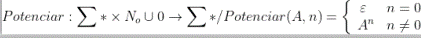

## GetLongitud

* Funcion: Obtiene el largo de una Cadena de Caracteres 
* Entrada: Cadena de caracteres
* Salida: Entero
  

## IsVacía

* Funcion: Indica si la Cadena de Caracteres es vacia 
* Entrada: Cadena de caracteres
* Salida: Entero. 1 si es vacio, 0 si tiene datos

## Potenciar

* Funcion: Obtiene una Cadena de Caracteres potenciada n veces
* Entrada: Cadena de caracteres, entero (la potencia)
* Salida: Cadena de Caracteres

## Concatenar

* Funcion: Obtiene la concatenacion de dos Cadenas de Caracteres 
* Entrada: Cadena de caracteres, Cadena de caracteres
* Salida: Cadena de caracteres

