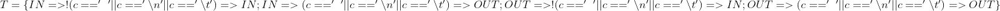

# Trabajo #5

## Autor de la resolución

* **Usuario GitHub:** mnigliazzo
* **Legajo:** 146.806.6
* **Apellido:** Nigliazzo
* **Nombre:** Matias Ezequiel

## Número y título del trabajo

* 10 - Máquinas de Estado — Palabras en Líneas

## Enunciado

### Objetivos

* Aplicar máquinas de estado para el procesamiento de texto.
* Implementar máquinas de estado con diferentes métodos.

### Temas

* Árboles de expresión.
* Representación de máquinas de estado.
* Implementación de máquinas de estado.

### Tareas

1. Árboles de Expresión
   1. Estudiar el programa del ejemplo las sección 1.5.4 Conteo de Palabras de [KR1988].
   2. Dibujar el árbol de expresión para la inicialización de los contadores: nl= nw = nc = 0.

   

   3. Dibujar el árbol de expresión para la expresión de control del segundo if: c == ' ' || c == '\n' || c = '\t'.
   
   
2. Máquina de Estado:
   1. Describir en lenguaje dot [DOT2015] y dentro del archivo [wl.gv](./wl.gv) la máquina de estado que resuelve el problema planteado.
   
   2. Formalizar la máquina de estados como una n-upla, basarse en el Capítulo #1 del Volumen #3 de [MUCH2012].
   
      

      

      

      
      
      
      
      

3. Implementaciones de Máquinas de Estado:

    Las implementaciones varían en los conceptos que utilizan para representaar los estados y las transiciones.
   1. Implementación #1: Una variable para el estado actual.
      1. Escribir el programa [wl-1-enum-switch.c](./wl-1-enum-switch.c) que siga la Implementación #1, variante enum y switch.

            Esta implementación es la regularización de la implementación de la sección 1.5.4 de [KR1988]. Los estados son valores de una variable y las transiciones son la selección estructurada y la actualización de esa variable. Esta versión es menos eficiente que la versión de [KR1988], pero su regularidad permite la automatización de la construcción del programa que implementa la máquina de estados. Además de la regularidad, esta versión debe:
            * Utilizar typedef y enum en vez de define, de tal modo que la variable estado se pueda declarar de la siguiente manera: State s = Out;
            * Utilizar switch en vez de if.
      2. Responder en readme.md: Indicar ventajas y desventajas de la versión de [KR1988] y de esta implementción. 

         * La implementación con switch presenta la mejora de que si se requiere agregar nuevas transiciones será necesaria agregar un `case` con la condicion de transición y por el estado nuevo. mientras que en la versión del `if` se dificulta dicha modificación. En cuanto a la desventaja, es que presentá repetición de codigo para las transiciones que van al mismo estado. Por otra parte, la ventaja de utilizar enum es que acota las posibilidades de valores a los estados y disminuye el error de una asignación erronea.
   2. Implementación #2: Sentencias goto (sí, el infame goto)
      1. Leer la sección 3.8 Goto and labels de [KR1988]
      2. Leer Go To Statement Considered Harmful de [DIJ1968].
      3. Leer "GOTO Considered Harmful" Considered Harmful de [RUB1987].
      4. Responder en readme.md: ¿Tiene alguna aplicación go to hoy en día? ¿Algún lenguaje moderno lo utiliza?

         Una aplicación para las sentencias de `GO TO` son el manejo de errores para las validaciones de datos

         Un ejemplo de lenguaje moderno que utiliza `go to` pueder ser:
         *  `C#`
         *  `Python`
         *  `Transact SQL`
         *  `GOLANG`

      5. Escribir el programa wl-2-goto.c que siga la Implementación #2.
   
        En esta implementación los estados son etiquetas y las transiciones son la selección estructurada y el salto incondicional con la sentencia goto.
   3. Implementación #3: Funciones Recursivas
      1.  Leer la sección 4.10 Recursividad de [KR1988].
      2.  Responder en readme.md: ¿Es necesario que las funciones accedan a contadores? Si es así, ¿cómo hacerlo?.
   
        Leer la sección 1.10 Variables Externas y Alcance y 4.3 Variables Externas de [KR1988].
      3. Escribir el programa, wl-3-rec.c que siga la implementación #3.
   
        En esta implementación los estados son funciones recursivas y las transiciones son la selección estructurada y la invocación recursiva. 
   4. Implementación #X:
   
        Es posible diseñar más implementaciones. Por ejemplo, una basada en una tabla que defina las transiciones de la máquina. En ese caso, el programa usaría la tabla para lograr el comportamiento deseado. El objetivo de este punto es diseñar una implementación diferente a las implementaciones #1, #2, y #3.
      1. Diseñar una nueva implementación e indicar en Readme.md cómo esa implementación representa los estados y cómo las transiciones.
      2.  Escribir el programa, wl-x.c que siga la nueva implementación. 
       
      Esta implentación hace uso de un puntero (multidimencional) a funcion, el cual ilustra la transiciones, indicando el estado actual, el estado destino y la acción que debe hacer (por medio de una función). Por lo que hay 3 funciones que hacen las acciones:
      * Una que no realiza ninguna accion.
      * Inserta el salto de linea
      * Inserta el caracter que leyó del archivo.
      
      Estas tres funciones reciben el valor entero de un caracter y el nombre del file donde se debe escribir el caracter. En la unica que tiene funcionalidad este parametro es en la que inserta el caracter en el archivo   

1. Eficiencia del uso del Tiempo:
   
    Construir una tabla comparativa a modo de benchmark que muestre el tiempo de procesamiento para cada una de las cuatro implementaciones, para tres archivos diferentes de tamaños diferentes, el primero en el orden de los kilobytes, el segundo en el orden de los megabytes, y el tercero en el orden de los gigabytes.
    La tabla tiene en las filas las cuatro implementación, en las columnas los tres archivos, y en la intersección la duración para una implementación para un archivo.

* Solos valores son en segundos

|Implementación  |1kb  |1mb  |1gb  |
|---------|---------|---------|---------|
|wl-1-enum-switch.c     |0         |0.076000         |80.295000         |
|wl-2-goto.c     |0         |0.077000         |76.964000         |
|wl-3-rec.c     |0         |         |         |
|wl-4.c     |0         |0.082000         |80.721000         |

Para la funcion recursiva no se llega a procesar los archivos de 1mb y 1gb. lo maximo que llego a procesar es un archivo de 44 kb, y demoró 0.005000 segundos

### Restricciones

* Ninguna

### Productos

* `readme.md`
  * Árboles de expresión.
  * Respuestas.
  * Benchmark.
* `wl.gv`
* `Makefile`
* `wl-1-enum-switch.c`
* `wl-2-goto.c`
* `wl-3-rec.c`
* `wl-x.c`

## Hipótesis de trabajo que surgen luego de leer el enunciado

Comprender lo que es una maquina de estado, como se grafica y formas de traducirlas a codigo

