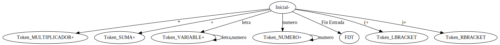

# Resolución

## Nivel léxico del lenguaje.

Las cateregorias léxicas o tokens que se hayan en el trabajo se puede categorizar en 4:

- Números.
- Variables.
- Suma.
- Multiplicacion
- Parentesis Izquierdo
- Parentesis Derecho

Para los Números, el lenguaje Regular que se debe detectar es:
```
<número natural> ::= <dígito> | <número natural> <dígito>
<dígito> ::= 0 | 1 | 2 | 3 | 4 | 5 | 6 | 7 | 8 | 9
```
Para las Variables, el lenguaje Regular que se debe detectar es:
```
<variables> ::= <letra> | <variables> <letra>
<letra> ::= a | b | c | d | e | f | g | h | i | j | k | l | m | n | o | p | q | r | s | t | u | v | w | x | y | z
```
Para los Suma, el lenguaje Regular que se debe detectar es:
```
<Suma> ::= +
```
Para los Multiplicacion, el lenguaje Regular que se debe detectar es:
```
<Multiplicacion> ::= *
```
Para el parentesis Izquierdo, el lenguaje Regular que se debe detectar es:
```
<LBracket> ::= (
```
Para el parentesis derecho, el lenguaje Regular que se debe detectar es:
```
<Rracket> ::= )
```
### Maquina de Estado


Cuando se codifico se generaron dos estados:
1. FDT, el cual indica que llego al ultimo caracter de la cadena
2. RECHAZO, el cual se utiliza para completar la maquina de estado para que no haya huecos


## Nivel sintáctico del lenguaje.

Para el nivel sintactico se generó el siguiente autómata:
```
<expresion>::= <termino> | <expresion> + <termino>
<termino> ::= <factor> |  <factor> * <termino>
<factor> ::= <numero> | <identificador> | ( <expresion> )
```

Para poder llevar a cabo esto, se debé generar una función Match, la cual invoca a GetNextToken, que valida el token que debe coincidir contra el proximo, si matchea el token es correcto, en caso contrario hay un error sintactico.

La técnica que se utilizó para el analisis Sintactico es la de `Analisis Sintactico Ascendente Recursivo` (ya que para este caso si importa la asociatividad a derecha), la cual se implementa por rutinas que se van invocando de forma recursiva, contruyendo así el analisis sintactico. Cada función se llama procedimiento de Analisis Sintactico (PAS)

Para poder obtener el resultado de la expresión (la operacion de reduccón), Cada PAS reduce la expresión a un valor entero. Para el caso de factor, devuelve el valor numerico del numero, o el identificado (para este ejercicio se definio por defecto que todos los identificadores tengan el valor 1). En el caso del PAS termino, en la rama de la multiplicacion se retorna el resultado devuelto por el factor multiplicado por el valor recursivo que retorne el PAS termino. Por ultimo para expresion, realiza lo mismo pero con la suma. Dada la forma de construccion de este automata, permite aplicar correctamente las reglas de asociatividad y de precedencia
